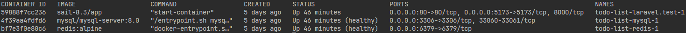

## Project setup
Prerequisite: Docker installed

To run the project, run the following command in terminal:

```bash
docker run --rm \
    -u "$(id -u):$(id -g)" \
    -v "$(pwd):/var/www/html" \
    -w /var/www/html \
    laravelsail/php83-composer:latest \
    composer install --ignore-platform-reqs
```

(You can use "-d" option to run in detached mode)

### **Important!** 

All the PHP commands you can find below should be executed from within the Sail container.

First, list the running containers using:
```
docker ps
```
You should see now a list like this:


In this case it's the first container listed (by default named _todo-list-laravel.test-1_). Now we can run:
```
docker exec -it todo-list-laravel.test-1 bash
```


## Running tests
Use the command:
```
php artisan test
```
To run all PHPUnit tests

If for some reason the database tables haven't been set up with the initial `./vendor/bin/sail up` command, run:

```
php artisan migrate
```

## API documentation
With the project running, you can browse the API documentation at
[http://localhost/docs](http://localhost/docs)

## Testing the api with manually executed requests:

To populate the _task_statuses_ table with the statuses needed, run:

```
php artisan db:seed --class=TaskStatusSeeder
```

If you need some dummy users for testing, use this command (the example below creates 10 of them):
```
php artisan create:users --count=10
```
The command also displays the __id__ and __email__ of newly created users.

The default password of the command-created users is "password".

So any of these emails can be used for authorization.
To receive the bearer token you must send a login request passing email and password as body parameters (detail in [API documentation](http://localhost/docs)).
Of course if you wish you can register a new user.